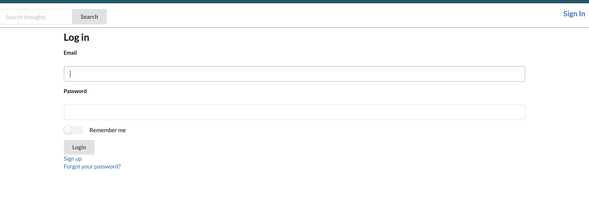
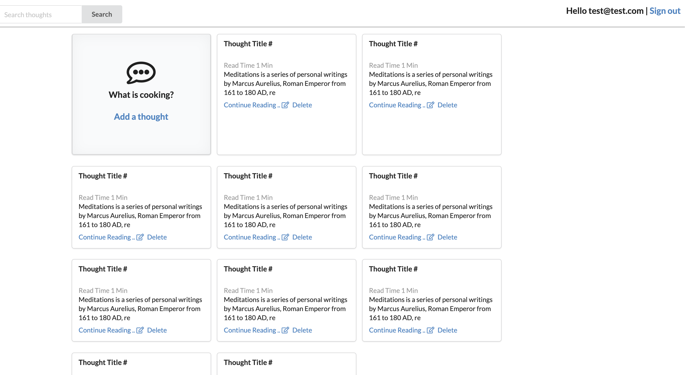
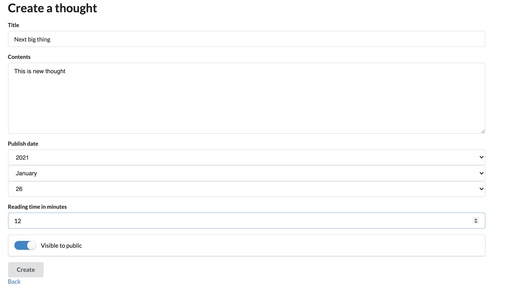
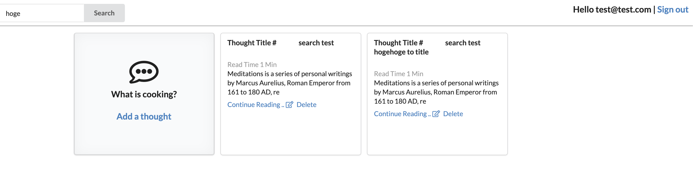

# [Meditations]('https://en.wikipedia.org/wiki/Meditations') is collection of `Thoughts`

## Snapshots
#### Login Page


#### Landing page (Thought list)

#### Create thought

#### Search thought


## Dependencies
- Ruby 2.6.6
- Rails 6.0.3
- MySQL Ver 8.0.21

## Seed entries

```
Devise user: id: test@test.com / pass: test001
```

Search for `hogehoge` which will return 2 results (one in title search and one in contents search)

Visible thoughts are 14
Hidden thoughts are 15
